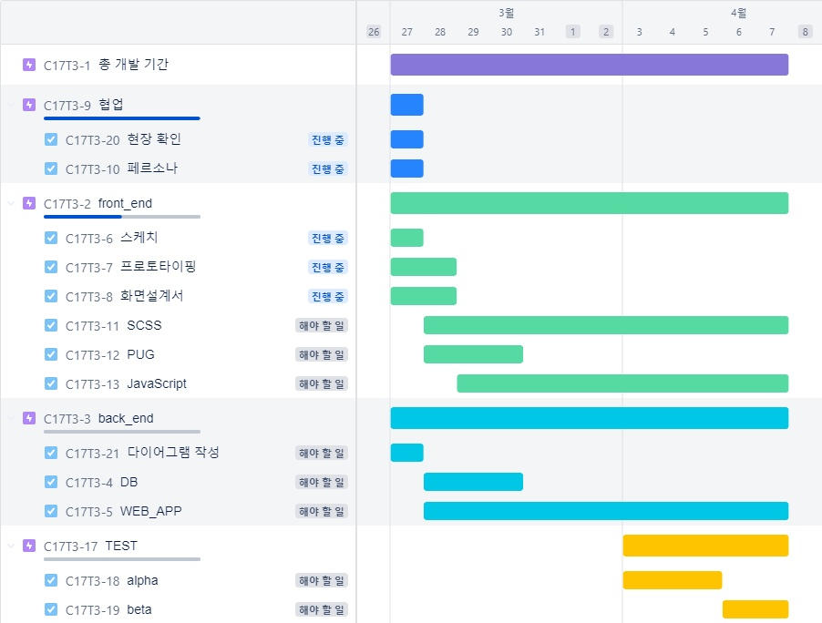

# 팀별 과제

## 주제 키오스크

### 계획표

### 페르소나

#### 20대 남자 정지석 23살

##### 직업

학생

##### 성격

꼼꼼 쾌할

##### 관심사

스포츠에 관심이 많다.

##### 취미

풋살, 스케이트 보드

##### 거주지

경기도 시흥시

##### 문제점

메뉴 주문 완료 시 주문한 메뉴의확인 화면이 출력되지 않는 문제, 메뉴 카운팅에서 맛의 맵기와 같은 메뉴의 설정부분도 메뉴의 갯수가 같이 카운팅 되는 문제를 경험함

##### 정보

갓 전역한 20대 남자로 성격이 쾌활하며 꼼꼼한 성격으로 주변 사람을을 잘 돌보는 인기 많은 복학생, 스포츠를 좋아하며 실내활동 보다는 야외활동을 즐김

---

#### 30대 여 이소연

##### 직업

웹디자이너

##### 성격

소심하고 차분한 성격

##### 관심사

바디프로필

##### 취미

넷플릭스 시청, 음악감상

##### 거주지

경기도 부천시

##### 문제점

영양 정보에 대한 안내가 없다. 알러지 정보에 대한 것이 표시되어 있지 않다.

##### 정보

본인의 소심한 성격을 극복하고자 최근 운동을 시작하며 그와 동시에 식단 조절에도 신경을쓰기 시작했다.
최근 실내에서 하는 작업위주로만 근무를 하던 와중, 잠깐 시간이 나 오랜만에 친한친구와 함께 평소 맛집이라고 잘 알려진 식당에 찾아가서 음식을 주문했으나 주문 하는 메뉴의 부실한 설명과 메뉴의 이름과 가격위주로만 적혀있는 메뉴를 주문한 결과 식사 중 본인의 알레르기인 견과류 땅콩 알레르기 증상이 발현됨
후에 알고보니 소스에 들어간 땅콩 소스가 원인이었는데, 메뉴설명에서는 그런 부분들을 찾아볼수 없었음.

---

#### 40대 남 박철호

##### 직업

택시 기사

##### 성격

전형적인 무뚝뚝한 남자

##### 관심사

정치, 투자

##### 취미

온라인 RPG게임

##### 거주지

대구 광역시 중구

##### 문제점

중구난방한 메뉴 구성과 저시력자라서 화면이 잘 안보인다. 메뉴의 사진이 비슷한데 설명이 적어서 구분이 안된다.
한눈에 들어오지 않는 메뉴의 구성과, 근시를 가지고 있어 메뉴주문의 화면이 잘 보이지않는다. 시력이 좋지 않다 보니 아무래도 화면을 가까이서 보게 되었음에도 불구하고, 메뉴들의 사진들이 비슷하게 생겨 원하던 메뉴를 주문하지 못하게 됨.
##### 정보

요근래 젊은 층들 사이에서 유행이라는 일본 가정식 음식점이 있는데, 그 음식점에 가자고 안달인 딸아이의 성화에 못이겨 가족들이 다같이 외식을 하러 방문하였으나, 메뉴 선택을 할 때 딸아이가 또래 친구들에게 추천받은 음식의 사진을 보여 주며 이 메뉴를 시켜달라고 졸라 그 메뉴 그대로 주문하였으나 알고보니 같은 사진의 다른 메뉴가 나왔고 자신이 원하던 메뉴가 아니라서 실망한 딸아이의 울음에 좋은 저녁식사 시간이 난감한 상황

---

#### 60대 여 김정려

##### 직업

부동산 중개업자

##### 성격

다혈질이면서 합리적이다.

##### 관심사

최근 초등학교를 입학한 막둥이 손녀딸에 대해서 관심이 많다.

##### 취미

등산, 골프

##### 거주지

서울시 도봉구

##### 문제점

중복 버튼이 너무 많음, 화면이 너무 작음
익숙하지 않은 UI로 인한 나쁜 UX

##### 정보

최근 초등학교를 갓 입학한 손녀와 함께 손녀의 학업을 위한 준비물들을 구매하고 난 뒤, 함께 점심을 먹으러 음식점에 갔으나 화면과 UI가 작아서 어느 부분들, 어느 버튼을 눌러도 같은 화면이 출력되고 추천메뉴조차 없어 메뉴 선택에 애로사항을 느꼈다. 할머니를 기다리다 지친 손녀딸이 배가고프다고 울먹이며 기다렸지만 결국 참다 참다 울음이 터지자 소란에 다가온 알바생에게 메뉴 선택을 하기 힘든 상황에 대한 책임을 물으며, 불편한 메뉴 선택화면에 대한 화를 냈다.

---

<!--
### 스케치
-->
